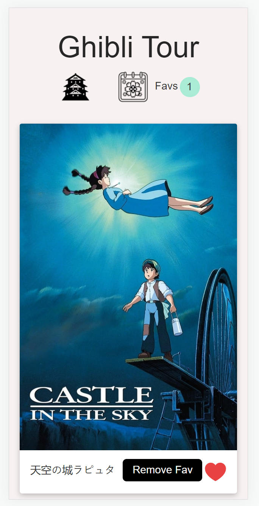
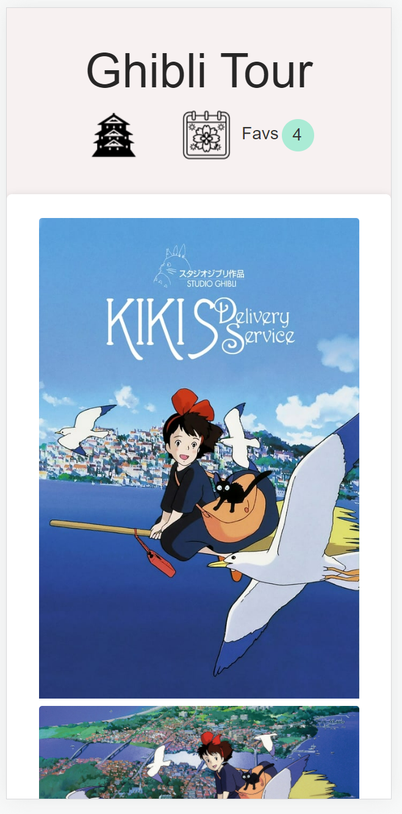
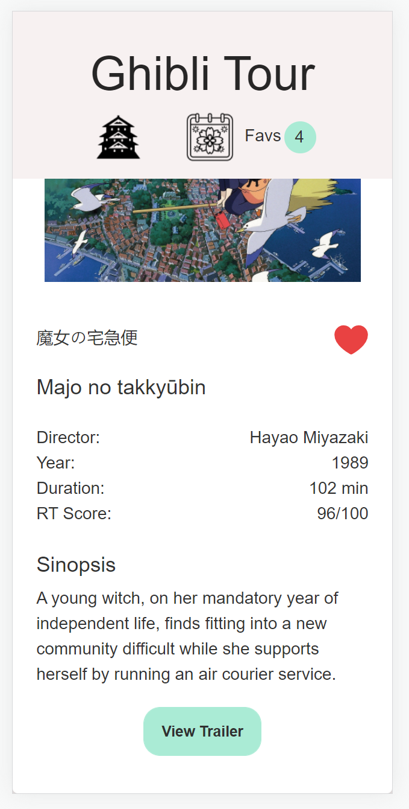
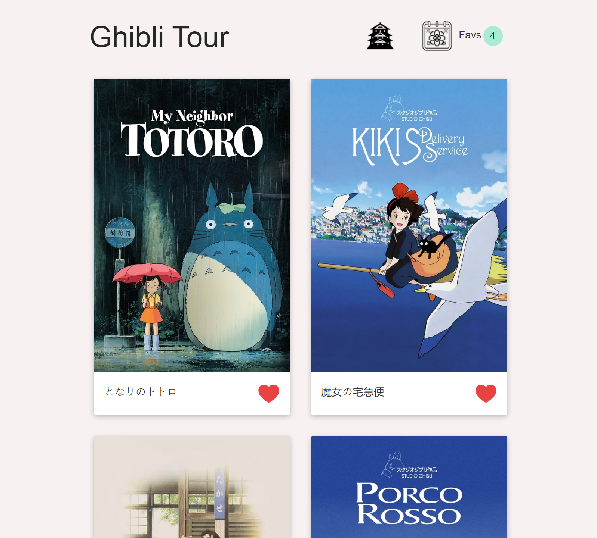
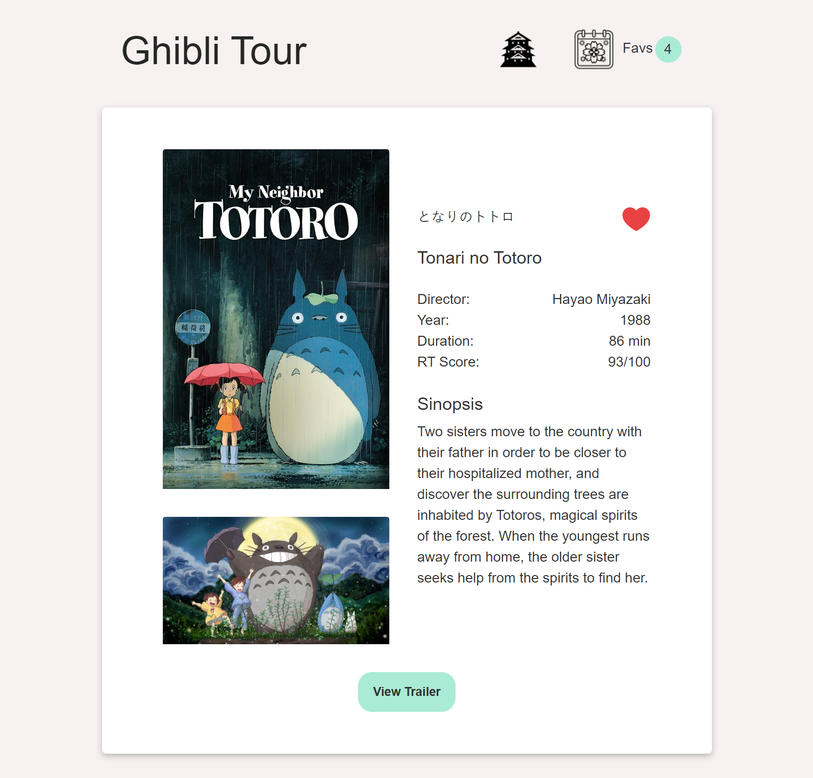
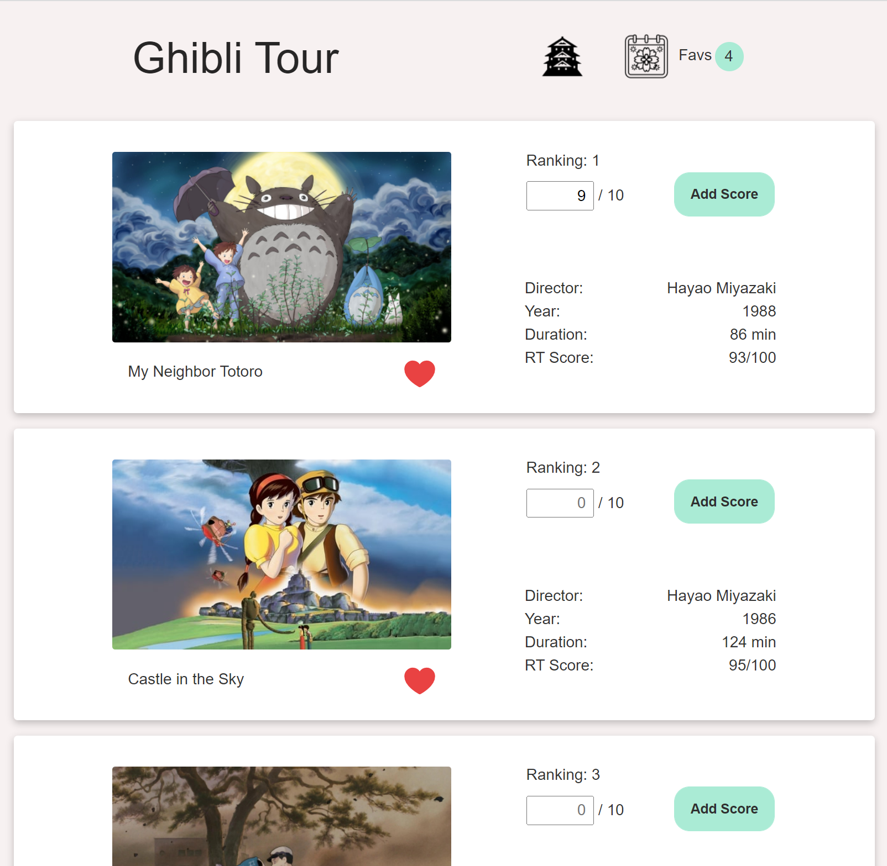

<p align="center">
  
</p>

# Ghibli Tour 	:star2:
>View, select and rate your favourite Ghibli Studio movies and create your own ranking! Made with Angular12 as Frontend and Jest for testing.
>

This project was generated with [Angular CLI](https://github.com/angular/angular-cli) version 12.2.16.

## Objectives

:zap: Learn new framework: Angular

:zap: Consume external API - Update 2023: API no longer available, JSON instead

:zap: Select and rate favourites to create a ranking

:zap: Display YouTube trailer with iframe

:zap: Apply services to update data for different routes

:zap: Custom directive to serve images when all loaded

:zap: Manage scroll behaviour on navigation: back and new route (why, Angular? why this default?)

:zap: Field custom validations on rating

:zap: Responsive 

:zap: Unit testing with Jest  


***
<p style="display: flex; flex-wrap: wrap; justify-content: space-around; margin-top: 1rem;">
  
  
  
</p>

<p style="display: flex; flex-wrap: wrap; justify-content: space-around">
  
  
  
  
</p>

***


## Installation 

Clone the repo, then install with Npm or Yarn and run with ng serve

```javascript
npm install
ng serve
```
Run global / unit tests
```javascript
npm run test:lib
npm run test:lib specific-operative.component.spec.ts
```
## Credits

API from James Anaipakos, great , beautifully documented

[https://github.com/janaipakos](https://github.com/janaipakos)

[https://ghibliapi.herokuapp.com](https://ghibliapi.herokuapp.com)


January 2023 Update: API sadly no longer available at herokuapp, updated with JSON instead.
